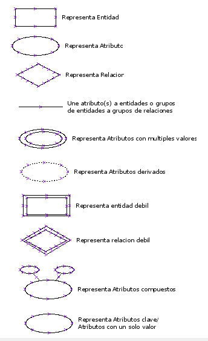

# Modelos de Datos - Ejercicio

En este ejercicio abordaremos una problemática usual en el mundo del desarrollo. Nos enfrentaremos a la lógica de un negocio particular, de análisis de requisitos, y modelamiento de datos datos progresivo para finalmente implementar una base de datos. Ésta será útil parar la implementación de un software que permita apoyar a una empresa en su operación.  

Resolveremos este problema en 3 Etapas. 

## Etapa 1  

Usted debe crear una hoja de cálculo como un favor para un grupo de amigos que poseen una empresa pequeña. Esta empresa fabrica una diversidad de tipos de artículos de cuero. El precio del artículo depende del los costos unitarios de la materia prima utilizada para la fabricación y adicionalmente del tiempo y esfuerzo invertidos en el proceso.   

La empresa compra cuero en lotes de diferentes tipos, cada uno de los cuales tiene un precio unitario que varia significativamente según la calidad y el momento de la compra.   

Las existencias en bodega son utilizadas de acuerdo a lo requerido por órdenes de compra que reciben de sus clientes. Cada lote de cuero en sus existencias provee material para múltiples productos vendidos a sus clientes.  

Se nos ha encomendado la tarea de crear una hoja de cálculo que permita visibilizar lo siguiente:  

1. Valor actualizado del total de activos (Materias primas y productos en existencia).  
2. Lotes de cuero en stock, clasificados según calidad.  
3. Precio y calidad del cuero utilizado para cada producto fabricado.  

Cree un repositorio GitHub de su archivo y ubíquelo en un directorio doc/ dentro del directorio principal del proyecto.  

## Etapa 2  

En este caso usted deberá modelar el escenario analizado en la Etapa 1, utilizando un diagrama ER. Se entrega a continuación un listado de los elementos estándar para la confección del diagrama.  

Se sugiere utilizar https://www.diagrams.net/ para dibujar su diagrama luego de bosquejarlo de manera manual.  

Debe justificar la eleccion de entidades, tipo de entidades, atributos, relaciones y conectores.  

Suba los archivos: fuente xml y render PDF de su diagrama. Éstos deben quedar ubicados en el directorio `doc/` creado en el repositorio GitHub de la Etapa 1.  

**Símbolos Diagramas ER**
  

